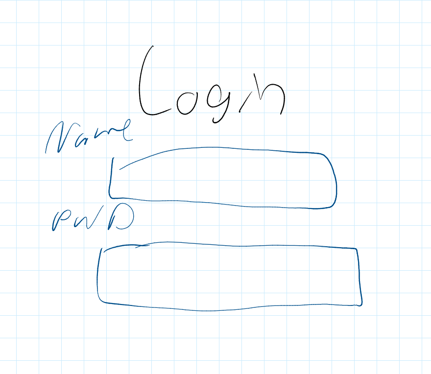
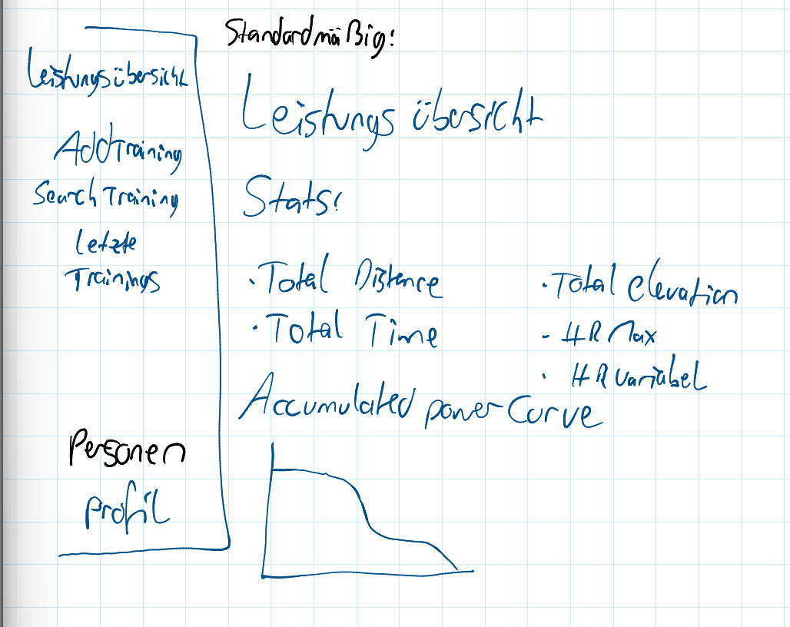
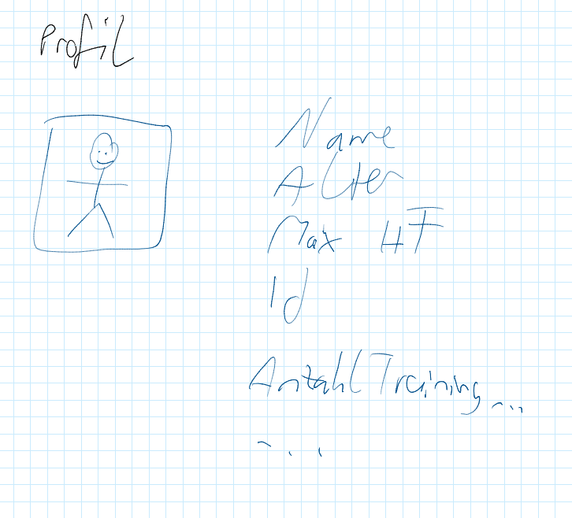
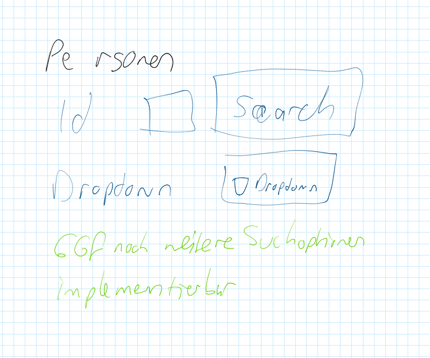
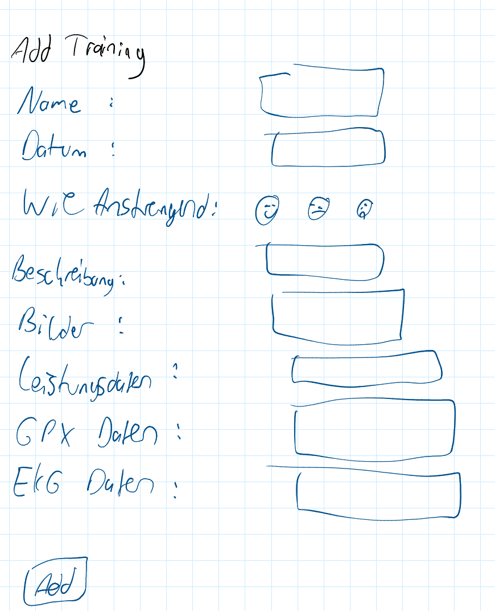
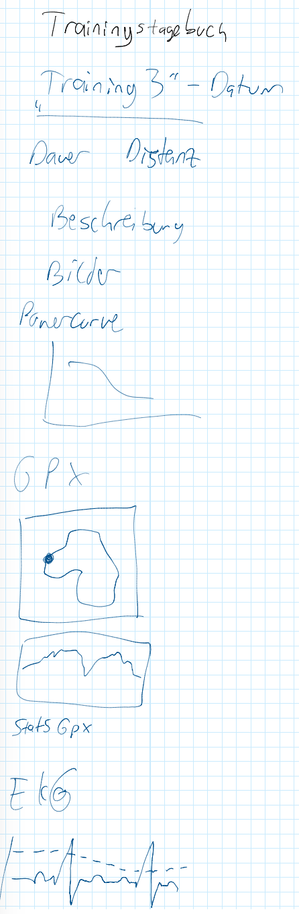

# Programier-bung_2_Abschlussarbeit
# Trainingstagebuch

## Angestrebter Aufbau
Es soll ein Art Trainingstagebuch App mit Leistungsanalysefunktionen gebaut werden.
Dazu soll man sich zuerst einloggen.

Nach dem Einloggen kommt man auf die Startseite. Hier wird eine Leistungsübersicht angezeigt. Dieses Design soll vorerst so gewählt werden:

Links in der Sidebar sollen dann noch andere Bereiche ausgewählt werden können.
Unter Profil bekommt man folgende Ansicht:

Der Diagnostiker/Admin hat außerdem ein Feld wo er Personen auswählen darf:

unter Pforfil bekommt er die Person angezeigt, die er gerade anschaut.

Weiter kann man die Tagebuchfuktion links auswählen. Da gibt es das Feld einen neuen Eintrag hinzuzufügen, das schaut dann so aus:

Wenn man dann ein Training anzeigen möchte, kann man entweder ein spezielles Training angezeigt bekommen oder es so machen, dass alle Trainings untereinander angezeigt werden.
Die Darstellung soll etwa so sein.

# Trainingstagebuch App

Willkommen zur Trainingstagebuch App. Diese Streamlit-Anwendung ermöglicht die Verfolgung sportlicher Aktivitäten, die Einsicht in detaillierte Statistiken und die Überwachung von Fortschritten. Administratoren haben zusätzlich die Möglichkeit, Profile zu verwalten und die Daten anderer Benutzer einzusehen.

---

## Inhaltsverzeichnis

- Funktionen
- Installation und Setup
- Anleitung zur Nutzung der App
- Login
- Dashboard
- Profil
- Workout hinzufügen
- Trainingsliste
- Für Administratoren: Person anschauen
- Für Administratoren: Profil hinzufügen
- Code-Struktur und wichtige Komponenten
- Fehlerbehebung

---

## 1. Funktionen

- *Benutzerverwaltung:* Sicheres Login-System mit config.yaml.
- *Profilverwaltung:* Persönliche Daten einsehen und bearbeiten, inklusive Profilbild und Maximalpuls.
- *Workout-Erfassung:* Hinzufügen neuer Trainingseinheiten mit Details wie Sportart, Dauer, Distanz, Puls, Kalorien, Anstrengung und Bewertung.
- *Dateianhänge:* Hochladen und Analysieren von GPX- (GPS-Tracks, Höhenprofile) und FIT-Dateien (Herzfrequenz, Leistung, Trittfrequenz, Geschwindigkeit). EKG-Daten können ebenfalls verlinkt werden.
- *Trainingsübersicht:* Eine detaillierte Liste aller aufgezeichneten Trainings mit Bearbeitungs- und Löschfunktionen.
- *Interaktives Dashboard:* Visualisierung aggregierter Trainingsdaten wie Gesamtdistanz, Gesamtzeit und eine akkumulierte Power Curve. Diese sind von mehreren Trainings zusammengefasst, um gegebenenfalls eine Leistungsverbesserung über die Zeit feststellen zu können.

### Admin-Funktionen:

- Neue Benutzerprofile mit zugehörigen Login-Konten erstellen.
- Die Ansicht auf die Daten anderer Benutzer wechseln.
- Passwörter von Benutzern zurücksetzen (als Admin).

---

## 2. Installation und Setup

Die Webapp ist über streamlit share öfentlich gemacht. Folgender Link bringt Sie zur Website:

- https://programier-bung2abschlussarbeit-jh-jl.streamlit.app/Trainingsliste

Zur lokalen Ausführung der App sind folgende Schritte erforderlich:

-  1 Klone das Repository von Git
 - 1.1 gehe auf das repository, dann auf code und kopiere den code
 - 1.2 Öffne ein neues Fenster auf VS Studio
 - 1.3 Klicke auf repository klonen und füge den Link ein
- 2 aktiviere das virtual environment mit pdm install
 - 2.1 öffne das powershell Terminal in
 - 2.2 gib "pdm install" ein
- 3 starte die App indem Sie im terminal im ordern des repositories pdm run streamlit run main.py eingeben.
 

Nun sollte das Repository geklont und das virtual environment aufgebaut sein und die App starten.

---

## 3. Anleitung zur Nutzung der App

Diese Sektion führt durch die Funktionen der Trainingstagebuch App.

### Login

- Beim Start der App wird der Login-Bildschirm angezeigt.
- Geben Sie den Benutzernamen und das Passwort ein, die in der config.yaml Datei festgelegt sind.
- Führen Sie den Login durch. Bei korrekten Daten erfolgt die Weiterleitung zum Dashboard. Bei falschen Daten wird eine entsprechende Meldung angezeigt.

### Dashboard

Das Dashboard bietet einen schnellen Überblick über die Trainingsdaten:

- *Gesamtdistanz:* Summe aller zurückgelegten Kilometer.
- *Gesamtzeit:* Kumulierte Dauer aller Trainingseinheiten.
- *Max. Herzfrequenz (Angabe):* Persönlich eingetragener Maximalpuls aus dem Profil.
- *Max. Herzfrequenz (Gemessen aus Dateien):* Höchster Puls, der in hochgeladenen FIT-Dateien gemessen wurde.
- *Höhenmeter:* Umschaltbare Anzeige für aufwärts oder abwärts zurückgelegte Höhenmeter.
- *Akkumulierte Power Curve:* Grafische Darstellung der besten durchschnittlichen Leistungen über verschiedene Zeiträume, basierend auf FIT-Dateien.

### Profil

Auf der Profilseite können persönliche Daten verwaltet und aktualisiert werden:

- *Persönliche Informationen:* Bearbeiten Sie Vorname, Nachname, Geburtsjahr, Geschlecht und Maximalpuls.
- *Profilbild hochladen:* Laden Sie ein Bild von Ihrem Computer hoch.
- *Änderungen speichern:* Sichern Sie die aktualisierten Informationen.
- *Benutzername oder Passwort ändern:* Geben Sie das aktuelle Passwort zur Bestätigung ein. Geben Sie dann einen neuen Benutzernamen (optional) und/oder ein neues Passwort ein. Nach dem Ändern des Benutzernamens ist eine erneute Anmeldung mit dem neuen Namen erforderlich.

### Workout hinzufügen

Diese Seite dient der Erfassung neuer Trainingseinheiten oder der Bearbeitung bestehender.

- *Neues Workout hinzufügen:*
  - Details eingeben: Füllen Sie Felder wie Name, Datum, Sportart, Dauer, Distanz, Puls, Kalorien, Anstrengung und Bewertung aus. Fügen Sie eine detaillierte Beschreibung hinzu.
  - Dateien hochladen: Laden Sie passende Bilder, GPX-Dateien (für GPS-Track und Höhenprofil), FIT-Dateien (für detaillierte Leistungsdaten) oder EKG-Dateien hoch.
  - Speichern: Fügen Sie das Training zur Datenbank hinzu.

- *Training bearbeiten:*
  - Wählen Sie ein Training aus der "Trainingsliste" zum Bearbeiten aus. Die Seite öffnet sich mit den vorhandenen Daten.
  - Nehmen Sie Änderungen vor und speichern Sie diese. Mit "Abbrechen" kehren Sie zur Trainingsliste zurück.

### Alle Trainings: Trainingsliste

Hier finden Sie eine vollständige Liste aller erfassten Trainings.

- *Übersicht:* Jedes Training wird als aufklappbarer Bereich (Expander) mit Name, Datum und Sportart angezeigt.
- *Details anzeigen:* Klicken Sie auf die Überschrift eines Trainings, um alle Details und Analysen der hochgeladenen Dateien zu sehen.
- *Interaktive Diagramme:* Für FIT-Dateien können Sie über Checkboxen auswählen, welche Diagramme (Herzfrequenz, Leistung, Geschwindigkeit, Trittfrequenz) angezeigt werden sollen.
- *Bearbeiten:* Klicken Sie auf "Bearbeiten 📝", um das Training im Formular "Workout hinzufügen" zu öffnen.
- *Löschen:* Klicken Sie auf "Löschen 🗑️", um ein Training dauerhaft aus der Datenbank zu entfernen. Diese Aktion kann nicht rückgängig gemacht werden.

---

### Für Administratoren: Person anschauen

(Diese Seite ist nur sichtbar, wenn Sie als Administrator angemeldet sind.)

- Als Administrator können Sie hier die Ansicht auf die Daten anderer Benutzer wechseln.
- *Person aus Liste auswählen:* Wählen Sie eine Person aus der Dropdown-Liste oder suchen Sie nach ID/Namen.
- *Ansicht wechseln:* Klicken Sie auf "Als '[Name der Person]' ansehen". Die App zeigt dann die Daten dieser Person an. Um zu den eigenen Daten zurückzukehren, wählen Sie "Mich selbst" aus der Liste.
- Passwort der Person ist auch von Admin einsehbar

---

### Für Administratoren: Profil hinzufügen

(Diese Seite ist nur sichtbar, wenn Sie als Administrator angemeldet sind.)

- Als Administrator können Sie hier neue Benutzerprofile erstellen und die zugehörigen Login-Daten in die config.yaml eintragen.
- *Profildaten eingeben:* Füllen Sie die Informationen für die neue Person aus.
- *Profilbild hochladen:* Laden Sie ein Profilbild für das neue Konto hoch.
- *Login-Daten festlegen:* Geben Sie einen Benutzernamen und ein initiales Passwort ein.
- *Profil & Benutzerkonto erstellen:* Speichern Sie das neue Profil und die Login-Daten.

*Wichtiger Hinweis:* Nach dem Erstellen eines neuen Profils muss die App neu gestartet werden, damit der neue Benutzer im Login-Bildschirm sichtbar wird.

---

## 4. Erfüllte Aufgabe:

Alle Basisaufgaben wurden erfüllt
- Es wurde jdeoch gewisse abwandlungen gemacht da dies  mit dem Stile der App besser zusammenpasst
  - Die Testdauer wird in Studnen und Minuten (statt nur in Minuten)
  - Die Auswahl der zeitberiche der Plots ist nur bei den EKG plots möglich, da bei den FIT-Plots die Kurven des gesammten trainings zuzeigen, logischer ist
  
  
Bei den zusatzaufgaben wurde folgendes erledigt
- Daten aus einer anderen Datenquelle einlesen (z.B. .fit oder txt .csv .gpx)
- Daten in einer tinyDB speichern
- Herzrate im sinnvollen gleitenden Durchschnitt als Plot anzeigen
- Kartendarstellung von gpx-Trainings-Files
- Höhenprofiel aus gpx-File
- login (nutzername und Passwort)
- permission system (Nutzer und Admin)
- passwortänderung durch nutzer und admin
- eigene admin funktionen ("profile hinzufügen" und "in ansicht von nutzer wechseln")
- akkumulierte Trainingsdaten über mehrer Trainings anzeigen inkl. Power curve
- viele unterschiedliche fit-file-plots auszuwählen
- auswertungen von .fit und.gpx files
- maximalpuls berechnung
- power curve pro training
- weitere Metriken
  - Höhenmeter (hoch und runter)
  - gesamtdistanz
  - gesamtzeit
- bewertung von trainings

---

## 5. Nutzer der App: